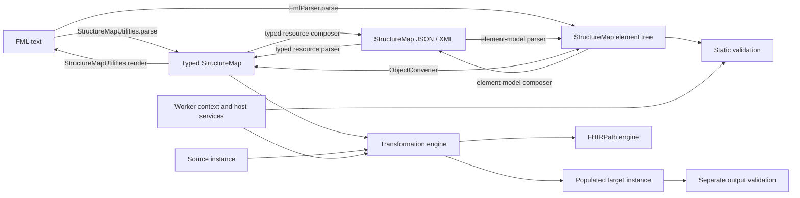

# Implementing the FHIR Mapping Language (using StructureMap)

This document describes where the code implementing HAPI's support for the FHIR Mapping Language (FML) lives and how the main components work together.

The R5 implementation is the detailed reference, with older-version differences and their file paths documented alongside it. The model/services modules are an initial draft R6 work area under active development and are not currently in use outside development and testing. They are described separately to support migration planning, not as an available replacement for the R5 APIs or a declaration of R6 conformance.

Implementation snapshot: September 12, 2026.

## Scope and Architecture

This guide is for developers integrating, maintaining, or extending the Java mapping implementation in this repository. R5 provides a concrete baseline for following the complete parsing and execution path. Older engines have their own differences; the draft R6 model/services work is still being brought up to parity and is not part of the current validation or transformation workflows.

The central R5 typed-model class is [StructureMapUtilities](../org.hl7.fhir.r5/src/main/java/org/hl7/fhir/r5/utils/structuremap/StructureMapUtilities.java). Its `parse(String text, String srcName)` constructs a StructureMap, static `render(StructureMap map)` produces FML, and `transform(Object appInfo, Base source, StructureMap map, Base target)` executes the map into a supplied target. The constructor creates a FHIRPath engine and installs the mapping-specific host services. Parsing and rendering are not the same operation as validation or execution.

Alongside it, [elementmodel/FmlParser](../org.hl7.fhir.r5/src/main/java/org/hl7/fhir/r5/elementmodel/FmlParser.java) independently parses FML into a definition-backed `Element` tree with source locations for validation. [Manager](../org.hl7.fhir.r5/src/main/java/org/hl7/fhir/r5/elementmodel/Manager.java) selects the element-model FML, JSON, or XML parser, while [ObjectConverter](../org.hl7.fhir.r5/src/main/java/org/hl7/fhir/r5/elementmodel/ObjectConverter.java) bridges element trees and typed resources. This is a parallel parsing and validation path, not a second transformation engine. FML output still uses the typed renderer: `FmlParser.compose` is not implemented. Source and target instances passed to transformation can use either representation.



The separate draft R6 work area contains [StructureMapTools](../org.hl7.fhir.services/src/main/java/org/hl7/fhir/services/fml/StructureMapTools.java) for parsing and transformation using `org.hl7.fhir.model` types. Its rendering methods delegate to [model StructureMapUtilities](../org.hl7.fhir.model/src/main/java/org/hl7/fhir/model/utilities/StructureMapUtilities.java), allowing the model module to render maps without depending on the services module. These classes are being actively developed and are not currently used by application workflows. They are neither aliases for the R5 engine nor a ready-to-use successor; the R6 migration section describes their intended organization and remaining gaps.

## Formats and Representations

### FML, StructureMap, and the In-Memory Model

FML is the textual mapping language. StructureMap is the resource that represents a map: its metadata, declared structures (`uses`), imports, constants, groups, sources, targets, and dependent group calls. JSON and XML are resource serializations of that representation, not different mapping languages.

There are two relevant R5 in-memory representations:

| Representation | Owning code | Main use |
| --- | --- | --- |
| Typed Java resource | [model/StructureMap.java](../org.hl7.fhir.r5/src/main/java/org/hl7/fhir/r5/model/StructureMap.java) | Parsing FML for execution, manipulating maps, and resource serialization |
| Definition-backed element tree | [elementmodel/Element.java](../org.hl7.fhir.r5/src/main/java/org/hl7/fhir/r5/elementmodel/Element.java) | Location-aware validation and working with instances described by loaded StructureDefinitions |

[ObjectConverter](../org.hl7.fhir.r5/src/main/java/org/hl7/fhir/r5/elementmodel/ObjectConverter.java) bridges element trees and typed resources. Source and target instances can also be typed resources or element-model instances; the latter are important when definitions do not match the generated Java resource classes.

Embedded FHIRPath expressions are stored in map fields as strings. The typed parser also caches parsed `ExpressionNode` objects in user data under keys such as `MAP_WHERE_EXPRESSION` and `MAP_EXPRESSION`. Runtime group resolution adds further caches. These caches are implementation state, not portable JSON/XML content, and execution can rebuild expression caches after resource deserialization. Do not treat a cached, previously executed map as an immutable syntax tree.

### Specification and Grammar References

Use the [R5 mapping-language specification](https://hl7.org/fhir/R5/mapping-language.html), [R5 StructureMap definition](https://hl7.org/fhir/R5/structuremap.html), and [FHIRPath specification](https://hl7.org/fhirpath/) as the published baseline. The [FML incubator](https://github.com/HL7/fml-incubator) contains evolving language material; comparisons against that work should identify the exact revision rather than assume it is identical to published R5.

The Java FML parsers are hand-written and use [FHIRLexer](../org.hl7.fhir.r5/src/main/java/org/hl7/fhir/r5/fhirpath/FHIRLexer.java) and [FHIRPathEngine](../org.hl7.fhir.r5/src/main/java/org/hl7/fhir/r5/fhirpath/FHIRPathEngine.java). They do not execute an ANTLR grammar at runtime. A grammar production, a field in the Java model, and an implemented transform are three different levels of support.

The R5 implementation accepts legacy `map "url" = "name"` declarations and newer `///` metadata, `let` constants, inline concept maps, group inheritance, nested rules, dependent calls, and shorthand identity rules. That list describes implementation surfaces, not a claim that every combination is supported at runtime. The parsing and execution sections describe important limits. A future grammar-conformance guide should pin its specification and code revisions and test parsing, rendering, validation, and execution separately.

## Parsing

### Typed-Model Parser

[StructureMapUtilities.parse](../org.hl7.fhir.r5/src/main/java/org/hl7/fhir/r5/utils/structuremap/StructureMapUtilities.java) takes FML text and a source name for diagnostics, returning `org.hl7.fhir.r5.model.StructureMap`. It strips a byte-order mark, reads metadata and declarations, and delegates to `parseGroup`, `parseRule`, `parseSource`, `parseTarget`, and `parseParameter`. Embedded FHIRPath is parsed by the engine's FHIRPath parser, not evaluated during this step.

Notable parsing behavior:

- Recognized metadata fields are `url`, `version`, `name`, `title`, `description`, `status`, and `experimental`. Unknown keys consume a constant but are silently dropped.
- An omitted status defaults to `draft`; an ID is derived from the name when possible; an omitted description falls back to the title.
- The parser accepts both brace-delimited groups and the older `input`/`endgroup` form. Rendering does not preserve the chosen input syntax.
- `parseConst` stores canonicalized FHIRPath text in `StructureMap.const`; it does not compute constant values.
- `parseFhirPathToCanonicalNode` removes redundant outer expression groups without removing parentheses needed for operations or invocations. Missing parentheses around `where`, `check`, and `log` are tolerated with a logging warning.
- Ordinary transform parameters are variable identifiers (`IdType`), strings, booleans, integers, or decimals. Arbitrary FHIRPath belongs in expression-bearing constructs such as `evaluate`, not in every parameter position.

Syntax failures normally raise a `FHIRLexerException`/`FHIRException`. Successful parsing does not resolve every import, prove type compatibility, or guarantee that a transform is implemented.

### Element-Model Parser

[elementmodel/FmlParser](../org.hl7.fhir.r5/src/main/java/org/hl7/fhir/r5/elementmodel/FmlParser.java) is a separate implementation, not a wrapper around the typed parser. `parse(List<ValidationMessage> errors, String text)` builds a definition-backed `Element` and marks locations on parsed fields. The stream API returns `ValidatedFragment` objects carrying the original content, parsed element, and diagnostics. [Manager](../org.hl7.fhir.r5/src/main/java/org/hl7/fhir/r5/elementmodel/Manager.java) provides the format-dispatch layer used by element-model callers.

It needs a worker context containing the applicable StructureMap definition, plus any definitions needed for contained resources. Depending on `ValidationPolicy`, parse failures are rethrown or recorded as fatal validation messages. Inspect those messages before validating or executing a partial parse. Language changes need matching coverage in both parsers; fixing only `StructureMapUtilities.parse` does not fix the validation input path.

### Loading JSON and XML

[formats/JsonParser](../org.hl7.fhir.r5/src/main/java/org/hl7/fhir/r5/formats/JsonParser.java) and [formats/XmlParser](../org.hl7.fhir.r5/src/main/java/org/hl7/fhir/r5/formats/XmlParser.java) parse serialized resources into typed models. Check that the parsed resource is a StructureMap.

Equivalent element-model parsers, [elementmodel/JsonParser](../org.hl7.fhir.r5/src/main/java/org/hl7/fhir/r5/elementmodel/JsonParser.java) and [elementmodel/XmlParser](../org.hl7.fhir.r5/src/main/java/org/hl7/fhir/r5/elementmodel/XmlParser.java), parse the same resource formats into definition-backed `Element` trees using a worker context. Call them directly or through `Manager.parseSingle(context, stream, format)` with `FhirFormat.JSON` or `FhirFormat.XML`. Like `FmlParser`, they provide the element-model input path used for validation rather than constructing generated Java resource classes.

These resource parsers do not parse FML text. Likewise, parsing StructureMap JSON/XML does not eagerly parse or validate every embedded FHIRPath string.

## Rendering

### FML Output

Static [StructureMapUtilities.render](../org.hl7.fhir.r5/src/main/java/org/hl7/fhir/r5/utils/structuremap/StructureMapUtilities.java) returns FML. Its helpers render concept maps, `uses`, imports, constants, groups, rules, sources, targets, and parameters. `groupToString`, `ruleToString`, `sourceToString`, `targetToString`, and `paramToString` expose smaller renderings useful in diagnostics.

The renderer writes `///` metadata even when the input used a legacy `map` declaration. It applies FHIRPath string escaping, uses triple-quoted descriptions when suitable, escapes element names where necessary, and writes normalized clause parentheses. Shorthand identity rules are expanded during parsing and eligible sequences can be collapsed again during rendering. Original whitespace, quoting choices, and all comment placement are not preserved.

Treat round trips as two separate checks:

1. FML -> StructureMap -> FML -> StructureMap should preserve the supported map semantics and relevant model fields.
2. FML -> StructureMap -> FML produces normalized text, not a byte-for-byte reconstruction of arbitrary input.

FML rendering is also not a general lossless export of every possible StructureMap resource field. The hard-coded metadata and language constructs determine what is represented. In particular, unknown input metadata has already been discarded by parsing.

### Resource Serialization and Narrative Rendering

Use the typed JSON/XML parsers' `compose` or `composeString` APIs to serialize a StructureMap resource. Use element-model composition for element trees. R5 `FmlParser.compose` explicitly throws `Error("Not done yet")`; selecting FML in the element-model composition path is not a substitute for the typed renderer. Convert a suitable element tree to a typed StructureMap before calling `StructureMapUtilities.render`.

[renderers/StructureMapRenderer](../org.hl7.fhir.r5/src/main/java/org/hl7/fhir/r5/renderers/StructureMapRenderer.java) produces human-readable HTML resource narrative. It is a different concern from FML source generation; its tests live in [StructureMapRendererTest](../org.hl7.fhir.r5/src/test/java/org/hl7/fhir/r5/test/rendering/StructureMapRendererTest.java).

## Validation

The validation module uses the R5 implementation, not the draft R6 model/services code. [InstanceValidator](../org.hl7.fhir.validation/src/main/java/org/hl7/fhir/validation/instance/InstanceValidator.java) owns resource validation and dispatches StructureMap-specific checks to [StructureMapValidator.validateStructureMap](../org.hl7.fhir.validation/src/main/java/org/hl7/fhir/validation/instance/type/StructureMapValidator.java).

| Stage | What it establishes | What it does not establish |
| --- | --- | --- |
| FML parsing | Accepted syntax and a map representation | Correct references, types, or executable transforms |
| StructureMap resource validation | Conformance to the loaded resource definition and applicable profiles | That mapping every possible input succeeds |
| Mapping-specific static validation | Checks of imports, groups, variables, source/target paths, transform parameters, and inferred expression types | Complete runtime feature support or host-service availability |
| Output validation | Conformance of a particular transformed instance to the selected target definitions/profiles | Correctness for other inputs or clinical/business equivalence |

`validateStructureMap` resolves imports, including wildcard imports through `ContextUtilities`, then checks constants and groups. Constants are processed in declaration order using `FHIRPathEngine.check` and a `VariableSet`; their inferred types are copied into group scopes. Groups are revisited as input type information becomes available. This is static checking, not lazy constant evaluation, and it does not share the runtime constant cache or cycle detection.

The worker context must contain the relevant StructureDefinitions and maps. Terminology-dependent checks also need suitable terminology resources/services. Missing imports can be warnings, and some limitations are reported as hints or informational messages. Callers should inspect the full `ValidationMessage` list and choose an explicit severity policy, rather than interpret the absence of an exception as success. Transform checking has an explicit not-checked diagnostic for cases it cannot assess.

The normal location-aware workflow is `FmlParser.parse(errors, text)`, followed by `InstanceValidator.validate(null, errors, null, element)`, as used in [StructureMapValidatorTests](../org.hl7.fhir.validation/src/test/java/org/hl7/fhir/validation/tests/StructureMapValidatorTests.java). Keep parser diagnostics and validation diagnostics together. Transformation does not automatically run this workflow or validate the output.

`StructureMapUtilities.analyse(appInfo, map)` is a separate analysis API that produces [StructureMapAnalysis](../org.hl7.fhir.r5/src/main/java/org/hl7/fhir/r5/utils/structuremap/StructureMapAnalysis.java), including target profiles and a summary. It is not the validator entry point and has its own transform-support limits. `generateMapFromMappings(StructureDefinition)` generates maps from logical mappings on a definition; it is not a general version converter.

## Transformation Execution

### Execution Flow

The low-level R5 entry point is `StructureMapUtilities.transform(appInfo, source, map, target)`. It returns `void` and mutates the supplied target. The main call sequence is:

1. Create a `TransformContext`, select `map.getGroup().get(0)`, and bind its source and target inputs in a `Variables` instance.
2. On each `executeGroup` entry, attach the owning map's `StructureMapConstantResolver` from the `TransformContext`, or clear the resolver if that map has no constants.
3. `executeGroup` executes any extended group first, then its own rules in order.
4. `executeRule` copies the scope, calls `processSource`, and executes the targets for each selected source item.
5. `processTarget` creates or assigns properties; `runTransform` implements operations such as `create`, `copy`, `evaluate`, `cast`, and `translate`.
6. Execute nested rules, dependent group calls, or inferred type-based group mappings where applicable. Sort the final target when it is an element-model instance.

`processSource` handles property selection or `@search`, type filtering, `where`, `check`, `log`, and source list modes. `where` removes nonmatching items; a false `check` throws. Source variables are bound for those expressions. Target `share` handling uses a shared-variable scope to reuse an output element.

Named and type-based group resolution first examines the current map, then matching imported maps in the worker context. Wildcard imports enumerate cached maps; declaring an import does not by itself download its dependencies. Missing and ambiguous matches produce exceptions, and successful resolutions are cached on map components.

Constants follow the map that owns the executing group, including dependent calls, inferred type-based calls, and group inheritance. [TransformContext](../org.hl7.fhir.r5/src/main/java/org/hl7/fhir/r5/utils/structuremap/TransformContext.java) retains one resolver per map instance for the duration of a transformation, so repeated calls into the same map share its lazy cache. Imported groups do not inherit the caller's constants, and the caller's resolver is restored when the group returns. `Variables.copy()` preserves the active resolver for nested rule scopes; fresh dependent/inferred group scopes receive the appropriate resolver on group entry without copying the caller's local bindings.

Important limits visible in the current runtime:

- The first group is the entry point; this overload does not accept an entry-group name. Root input binding supports at most one source and one target input.
- When the entry group declares a target, supply an instance. Automatic root creation from a null target is explicitly unimplemented.
- `getTargetType(map)` requires exactly one `uses ... as target` declaration. It is not a general resolver for maps with several target declarations.
- `executeRule` rejects rules with multiple source components.
- `evaluate` returns no assignment for an empty result and throws for more than one result.
- `escape` and `dateOp` throw unsupported-transform exceptions. `cast` requires an explicit type and supports the primitive types enumerated in its switch.
- The parser stores source `default` as FHIRPath text, but `processSource` currently inserts `getDefaultValueElement()` directly when the property is absent. Do not assume arbitrary default expressions are evaluated by this path.

Execution is not transactional: earlier target mutations and host callbacks can occur before an exception. Use a fresh target for an attempt and decide explicitly how to handle partially created resources. The utility, map caches, and mutable values do not establish a thread-safety contract; do not assume concurrent reuse is safe without an application-level strategy.

For higher-level integration, [ValidationEngine.transform](../org.hl7.fhir.validation/src/main/java/org/hl7/fhir/validation/ValidationEngine.java) fetches the map by URI, determines source/target definitions from its first group, parses the input, builds the target, and invokes the R5 utility. It requires a single typed target parameter. Its `compile(mapUri)` currently fetches a map from the context; it is not a separate bytecode compiler or a validation pass.

### FHIRPath Integration

The mapping utility owns a `FHIRPathEngine` configured with [FHIRPathHostServices](../org.hl7.fhir.r5/src/main/java/org/hl7/fhir/r5/utils/structuremap/FHIRPathHostServices.java). Runtime `where`, `check`, `log`, `@search`, and `evaluate` expressions pass the current [Variables](../org.hl7.fhir.r5/src/main/java/org/hl7/fhir/r5/utils/structuremap/Variables.java) as FHIRPath `appContext`. Expression focus depends on the construct: a selected source item for source clauses, or the specified focus for `evaluate`.

For names delegated to the mapping host, lookup order is INPUT variable, OUTPUT variable, then map constant. FHIRPath built-ins are managed by the FHIRPath engine itself. [StructureMapConstantResolver](../org.hl7.fhir.r5/src/main/java/org/hl7/fhir/r5/utils/structuremap/StructureMapConstantResolver.java) evaluates a constant on first use, caches the resulting collection, and detects recursive references. It evaluates in a fresh scope containing the resolver but no source/target bindings. Unused constants are not evaluated merely by executing the map.

The `appInfo` argument to `transform` is not the same object as this FHIRPath `appContext`. Direct transformation callbacks such as creation and search receive the former; FHIRPath custom functions and reference resolution are passed the mapping scope by the FHIRPath host adapter. A host implementation must not blindly cast every callback's context to its application context type.

The adapter delegates `resolveFunction`, `checkFunction`, and `executeFunction` to `ITransformerServices`, allowing custom FHIRPath functions. There is no equivalent host-constant fallback in its `resolveConstant` method. Adding a `%name` resolver to a separately created FHIRPath engine does not make that constant visible inside the mapping utility's private engine.

See [FHIRPath Constants and FHIR Mapping Language `let` Constants](structuremap-and-fhirpath-constants.md) for the constant-resolution design and examples, including per-map scope and cache lifetime.

### Runtime Dependencies and Host Responsibilities

The [IWorkerContext](../org.hl7.fhir.r5/src/main/java/org/hl7/fhir/r5/context/IWorkerContext.java) provides definition, map, and terminology access. Load the required core packages, implementation-guide definitions, imported StructureMaps, and ConceptMaps before execution. A map's declared URLs and aliases must resolve against that context; the name of the Java engine module alone does not select all source/target definitions.

[ITransformerServices](../org.hl7.fhir.r5/src/main/java/org/hl7/fhir/r5/utils/structuremap/ITransformerServices.java) is the host integration contract:

| Callback | Host responsibility |
| --- | --- |
| `createType` | Construct a requested type using definitions and the chosen object/element representation |
| `createResource` | Identify, collect, or store a newly created resource; the engine passes an existing instance |
| `translate` | Provide terminology translation when the engine delegates it |
| `resolveReference` | Resolve references requested by embedded FHIRPath |
| `performSearch` | Execute the search requested by an FML `@search` source |
| `log` | Handle mapping logs and trace output |
| `resolveFunction`, `checkFunction`, `executeFunction` | Define, type-check, and execute custom FHIRPath functions |

Services are optional for maps that only use built-in capabilities, but not for constructs that require those callbacks. The utility has a built-in type factory when no service is supplied. Translation also has engine-side handling for map-contained and context-resolved ConceptMaps.

[TransformSupportServices](../org.hl7.fhir.validation/src/main/java/org/hl7/fhir/validation/TransformSupportServices.java) is the validator application's implementation: it creates element-model instances, collects root-level resources, and delegates translation to `ConceptMapEngine`. Its `resolveReference` and `performSearch` methods explicitly throw unsupported-operation errors. Applications needing these features must provide their own implementations, with appropriate access controls and resource limits; executing a map is not a sandbox.

## Testing and Troubleshooting

### Test Locations and Commands

| Test | Coverage and prerequisites |
| --- | --- |
| [R5 StructureMapUtilitiesTest](../org.hl7.fhir.r5/src/test/java/org/hl7/fhir/r5/test/StructureMapUtilitiesTest.java) | Syntax, rendering, escaping, normalization, analysis, and selected transforms; loads R4 core definitions and shared `r5/structure-mapping` fixtures |
| [R5 ConstantResolverTests](../org.hl7.fhir.r5/src/test/java/org/hl7/fhir/r5/utils/structuremap/ConstantResolverTests.java) | Literal/dependent constants, circular references, variable shadowing, local/imported group calls, inheritance, and per-map/per-transform cache lifetime |
| [StructureMapValidatorTests](../org.hl7.fhir.validation/src/test/java/org/hl7/fhir/validation/tests/StructureMapValidatorTests.java) | Inline FML examples and expected mapping-specific diagnostics using R5 definitions |
| [StructureMapConstantsTests](../org.hl7.fhir.validation/src/test/java/org/hl7/fhir/validation/tests/StructureMapConstantsTests.java) | Constant validation, typed-model execution, analysis, round trips, and agreement between the two parsers; its element-model execution method is currently empty |
| [StructureMappingTests](../org.hl7.fhir.validation/src/test/java/org/hl7/fhir/validation/tests/StructureMappingTests.java) | Manifest-driven transformations through `ValidationEngine`, including comparison with expected JSON and logical-model cases |
| [StructureMapRoundTripTests](../org.hl7.fhir.validation/src/test/java/org/hl7/fhir/validation/tests/StructureMapRoundTripTests.java) | External FML examples, parser comparison, static validation, analysis, and execution; local prerequisites and side effects described below |
| [R4B StructureMapUtilitiesTest](../org.hl7.fhir.r4b/src/test/java/org/hl7/fhir/r4b/test/StructureMapUtilitiesTest.java) | Older-engine syntax and transformation checks |
| [R4 StructureMapUtilitiesFunctionDelegationTest](../org.hl7.fhir.r4/src/test/java/org/hl7/fhir/r4/test/StructureMapUtilitiesFunctionDelegationTest.java) | Custom FHIRPath function delegation in the R4 engine |
| [Standalone StructureMapToolsTest](../org.hl7.fhir.standalone/src/test/java/org/hl7/fhir/test/StructureMapToolsTest.java) | Development tests for the draft R6 work area, which is not currently used by application workflows; not tests of the R5 utility |

Run commands from the repository root with Maven and a compatible JDK; the parent [pom.xml](../pom.xml) targets Java 17. Focused examples are:

```powershell
mvn test -pl org.hl7.fhir.r5 "-Dtest=StructureMapUtilitiesTest,ConstantResolverTests"
mvn test -pl org.hl7.fhir.validation "-Dtest=StructureMapValidatorTests,StructureMapConstantsTests,StructureMappingTests"
```

Module-only builds use sibling artifacts in the local Maven repository. Build/install matching checkout dependencies first when they are missing or stale; see the root [README.md](../README.md). Shared fixtures come from the `org.hl7.fhir.testcases:fhir-test-cases` dependency and its test-resource helpers. Package-backed tests also need their requested FHIR packages in the package cache or access to download them. Do not assume that fixtures are all under this repository's test-resource folders.

The local [CLAUDE.md](../CLAUDE.md) requires `mvn test -pl <module>` after test changes. The focused commands are useful during development, but do not replace that full-module check. CI uses module-level Maven verification as configured in [test-unit-jobs-template.yml](../test-unit-jobs-template.yml).

`StructureMapRoundTripTests` currently hard-codes `C:\git\hl7-incubators\fml-incubator\input\examples`. It also expects neighboring test-input folders and writes rendered maps and execution outputs into that external checkout. Its execution methods write results without asserting expected output. Treat it as a local exploratory suite, not evidence of portable end-to-end regression coverage, and inspect its paths before running it. A full validation-module run includes these tests.

The [standalone pom.xml](../org.hl7.fhir.standalone/pom.xml) sets `skipTests=true` because its draft R6 tests depend on locally patched packages. This command is for work on the draft implementation, not for testing an alternative engine in current use. Only with those prerequisites available, opt in explicitly:

```powershell
mvn test -pl org.hl7.fhir.standalone -DskipTests=false "-Dtest=StructureMapToolsTest"
```

### Diagnosing Failures

| Symptom | First place to check |
| --- | --- |
| Lexer error or unexpected token | FML parser, source location, metadata form, and embedded FHIRPath syntax |
| Unknown structure, import, or group | Loaded packages/maps, canonical URLs and versions, aliases, and wildcard matches |
| Unknown variable or incompatible types | Input/output mode, rule scope, constant visibility, and `StructureMapValidator` diagnostics |
| Unsupported transform or callback | `runTransform` and the actual `ITransformerServices` implementation, not just the grammar |
| `evaluate` returns several objects | Expression collection cardinality; use rule iteration or an intentionally singleton expression |
| Unexpected default value | The distinction between parsed default-expression text and the runtime default insertion path |
| Output is incomplete or invalid | Source filters, target mutations, trace callbacks, and separate output-profile validation |
| JSON/XML round trip differs from FML round trip | Fields outside the renderer's supported subset, normalization, and nonserialized caches |
| Missing fixture/package or runtime class | Test prerequisites, matching sibling artifacts, and current module build outputs before investigating mapping semantics |

For a regression, retain the FML, source instance, expected output, relevant definitions/imports, and expected diagnostic IDs. Test both parser representations when changing syntax. For runtime changes, assert outputs rather than merely asserting that execution did not throw. For conversion changes, assert both preserved fields and any deliberate loss/rejection.

## Versioning and Conversion

### Version Boundaries

Keep these version dimensions separate:

| Dimension | Meaning |
| --- | --- |
| Java library version | The library's Maven artifact version; not the FHIR release number |
| Engine/model family | The R4, R4B, or R5 Java types and APIs; draft R6 model/services types remain development-only |
| Map representation | The StructureMap definition and FML feature set used to describe the mapping |
| Map business version | `StructureMap.version` / `/// version`, identifying a revision of that particular map |
| Source/target definitions | The releases, profiles, or logical models describing the actual input/output instances |

For example, the R5 utility tests load R4 definitions into an R5 worker context and use element-model instances. That does not turn an R5 generated `Patient` into an R4 Java `Patient`. A cross-version execution setup needs compatible representations and the appropriate definitions for both sides. Converting a map resource does not automatically rewrite all of its referenced structure URLs or embedded expressions.

### Implementation Locations

| Family | Main locations and differences |
| --- | --- |
| DSTU2016May | [StructureMap model](../org.hl7.fhir.dstu2016may/src/main/java/org/hl7/fhir/dstu2016may/model/StructureMap.java) and version converters; no corresponding native FML utility was found in this module |
| DSTU3 | [StructureMap model](../org.hl7.fhir.dstu3/src/main/java/org/hl7/fhir/dstu3/model/StructureMap.java) and converters; no corresponding native FML utility was found in this module |
| R4 | [utils/StructureMapUtilities](../org.hl7.fhir.r4/src/main/java/org/hl7/fhir/r4/utils/StructureMapUtilities.java); parser requires a `map` header, supports literal defaults, and has no `parseConst` path |
| R4B | [utils/structuremap/StructureMapUtilities](../org.hl7.fhir.r4b/src/main/java/org/hl7/fhir/r4b/utils/structuremap/StructureMapUtilities.java); likewise requires a `map` header and has no `parseConst` path |
| R5 | [utils/structuremap/StructureMapUtilities](../org.hl7.fhir.r5/src/main/java/org/hl7/fhir/r5/utils/structuremap/StructureMapUtilities.java), the element-model parser, and the validation module described above |
| Draft R6 work area (not currently in use) | [model.fml.StructureMap](../org.hl7.fhir.model/src/main/java/org/hl7/fhir/model/fml/StructureMap.java), model-level rendering, [services.fml.StructureMapTools](../org.hl7.fhir.services/src/main/java/org/hl7/fhir/services/fml/StructureMapTools.java), and [services.elementmodel.FmlParser](../org.hl7.fhir.services/src/main/java/org/hl7/fhir/services/elementmodel/FmlParser.java); under active development |

The R5 package name is not a guarantee that all implemented FML features are frozen at the published 5.0.0 specification; FML support continues to evolve. The draft R6 work is not yet at feature parity: R5 has a lazy constant resolver, while `StructureMapTools.transform` currently creates only local variable bindings and its FHIRPath host has no map-constant fallback.

### Converting Between Versions

The [convertors README](../org.hl7.fhir.convertors/README.md) describes the Java resource-conversion layer. For established version pairs, enter through a `VersionConvertorFactory_*` rather than invoking leaf converters without their conversion context. For example, [VersionConvertorFactory_40_50](../org.hl7.fhir.convertors/src/main/java/org/hl7/fhir/convertors/factory/VersionConvertorFactory_40_50.java) provides overloaded `convertResource` methods for R4 -> R5 and R5 -> R4, with optional advisors.

StructureMap-specific implementations include:

| Pair | StructureMap converter |
| --- | --- |
| DSTU2016May <-> R4 / R5 | [StructureMap14_40](../org.hl7.fhir.convertors/src/main/java/org/hl7/fhir/convertors/conv14_40/resources14_40/StructureMap14_40.java), [StructureMap14_50](../org.hl7.fhir.convertors/src/main/java/org/hl7/fhir/convertors/conv14_50/resources14_50/StructureMap14_50.java) |
| DSTU3 <-> R4 / R5 | [StructureMap30_40](../org.hl7.fhir.convertors/src/main/java/org/hl7/fhir/convertors/conv30_40/resources30_40/StructureMap30_40.java), [StructureMap30_50](../org.hl7.fhir.convertors/src/main/java/org/hl7/fhir/convertors/conv30_50/resources30_50/StructureMap30_50.java) |
| R4 <-> R5 | [StructureMap40_50](../org.hl7.fhir.convertors/src/main/java/org/hl7/fhir/convertors/conv40_50/resources40_50/StructureMap40_50.java) |
| R4B <-> R5 | [StructureMap43_50](../org.hl7.fhir.convertors/src/main/java/org/hl7/fhir/convertors/conv43_50/resources43_50/StructureMap43_50.java) |
| R4 / R4B / R5 <-> draft R6 model (development work) | [StructureMap40_N](../org.hl7.fhir.convertors/src/main/java/org/hl7/fhir/convertors/conv40_N/resources40_N/StructureMap40_N.java), [StructureMap43_N](../org.hl7.fhir.convertors/src/main/java/org/hl7/fhir/convertors/conv43_N/resources43_N/StructureMap43_N.java), [StructureMap50_N](../org.hl7.fhir.convertors/src/main/java/org/hl7/fhir/convertors/conv50_N/resources50_N/StructureMap50_N.java) |

Presence of a converter is not a claim of lossless conversion or executable equivalence. Concrete examples from `StructureMap40_50` are:

- The R5 -> R4 top-level conversion does not copy `const` declarations. A map that depends on them cannot be assumed to retain its behavior.
- R4 dependent calls use a string `variable` list; R5 uses typed `parameter` values. Non-ID values can be preserved through `EXT_ORIGINAL_VARIABLE_TYPE` extensions, which an older execution engine does not thereby learn to evaluate.
- Source defaults cross a datatype boundary: R4 has a typed default, while this R5 model stores a string. The converter casts the converted R4 default to R5 `StringType`; arbitrary typed defaults are not automatically converted into equivalent FHIRPath expressions.

`StructureMap50_N` explicitly copies constants in both directions, but that preserves representation, not the draft R6 engine's runtime constant support. These converters are part of the initial R6 development work, not an indication that the draft engine is in use. Its generated header identifies R6 ballot work; it should not be treated as a final-R6 compatibility promise.

Always validate the converted map against the intended definitions, inspect known loss points, and execute representative source/target tests. Java conversion of a StructureMap is distinct from running an FML map that transforms, for example, an R4 resource into an R5 resource.

## R6 Migration Recommendations

### Current State

The model/services modules are the initial draft R6 work area. Active work is underway to bring them up to speed, but they are not currently used outside development and testing and do not replace the R5 implementation. The [model readme](../org.hl7.fhir.model/readme.md) and [services readme](../org.hl7.fhir.services/readme.md) explicitly label them experimental. The following describes work in progress, not an available runtime:

- The draft StructureMap model lives in `org.hl7.fhir.model.fml`, with generated [FmlJsonParser](../org.hl7.fhir.model/src/main/java/org/hl7/fhir/model/fml/FmlJsonParser.java), [FmlXmlParser](../org.hl7.fhir.model/src/main/java/org/hl7/fhir/model/fml/FmlXmlParser.java), and [FmlRegistration](../org.hl7.fhir.model/src/main/java/org/hl7/fhir/model/fml/FmlRegistration.java).
- `FmlRegistration.register(modelContext, overridesBase)` registers StructureMap handlers for a particular model context. Its generated header and `packages()` identify `hl7.fhir.uv.fml#current`; the matching definitions must be loaded into the worker context. These JSON/XML handlers are not the FML text parser.
- Rendering is in the model module; parsing and execution are in services; context-backed tests are in standalone. New collection accessors such as `getGroupList()` differ from R5's `getGroup()`.
- The validation module remains R5-based. The draft R6 [FHIRPathHostServices](../org.hl7.fhir.services/src/main/java/org/hl7/fhir/services/fml/FHIRPathHostServices.java) still throws for `conformsToProfile` and FHIRPath logging, and does not implement R5's map-constant resolution.
- Draft R6 standalone tests are disabled by default pending suitable package builds. Their existence is not evidence that the draft is in use or that R6 behavior is continuously verified.

### Recommended Work

1. **Pin the contract.** Record the supported R6 ballot/release, FML package and grammar revision, Java library revision, and compatibility policy. Avoid mutable `current` dependencies for reproducible conformance claims.
2. **Preserve generation ownership.** Follow the [generator readme](../org.hl7.fhir.core.generator/readme.md): older models are maintained by hand, while R6 generation uses definitions and templates. Update generation inputs rather than only generated output. StructureMap-specific customization examples are in [configuration/StructureMap.java](../org.hl7.fhir.core.generator/configuration/StructureMap.java) and [add-ons-config-r6/StructureMap.java](../org.hl7.fhir.core.generator/add-ons-config-r6/StructureMap.java). The generator is not built by the normal parent reactor; verify it separately when changing it.
3. **Establish parser/renderer parity.** Run the same corpus through both typed and element-model parsers and the model-level renderer. Include metadata, escaping, defaults, constants, nested/dependent groups, shorthand rules, and JSON/XML round trips. Preserve the model-to-services dependency direction.
4. **Close runtime gaps deliberately.** Port constant evaluation and host behavior with explicit tests, including R5's per-map ownership and per-transform caching across dependent, inferred, and inherited groups. Address default-expression execution. Decide which unsupported transforms and multi-source cases are required rather than silently inheriting partial behavior.
5. **Plan validator migration separately.** Preserve diagnostic IDs, source locations, static type behavior, terminology integration, and custom-function type checking when moving beyond the R5 validator. A model converter alone is not a validator migration.
6. **Make conversion loss explicit.** Document which newer constructs are rejected, preserved through extensions, or lost when targeting older engines. Test actual execution after conversion, not just structural equality.
7. **Make the corpus portable.** Replace hard-coded external paths and output-writing experiments with versioned fixtures and assertions. Enable experimental tests in CI only once package dependencies are reproducible, then require output and diagnostic regression checks before declaring parity.

### Open Decisions and Acceptance Criteria

Open decisions include the supported legacy FML forms, the host contract for external constants, and the lifecycle/thread-safety policy for cached maps and engines. These are proposed decision points, not commitments made by the current code.

Before promoting the draft R6 engine into use, require agreement between the parsers, stable supported round trips, expected static diagnostics, asserted typed-model and element-model transformation outputs, tested host callbacks, explicit conversion-loss behavior, and a passing reproducible CI corpus. Keep R5 behavior available until any intentional differences are documented and tested.
