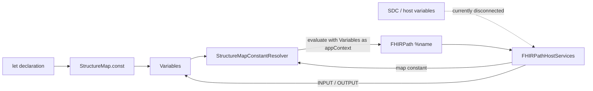

## FHIRPath Constants and FHIR Mapping Language `let` Constants
FHIRPath provides the underlying constant-resolution mechanism.
StructureMap and the FHIR Mapping Language (FML) use FHIRPath constants and also build on that mechanism with map variable and map-owned constants declared with `let`. 

## FHIRPath foundation
FHIRPath expressions reference constants using `%name`. Some constants are
provided directly by `FHIRPathEngine`; others are supplied by the application
hosting the engine (using `IHostApplicationServices`).

### Engine constants
The `FHIRPathEngine` resolves built-in constants such as `%context`, `%resource`, and
`%rootResource` from its internal execution context (initialized via arguments to `evaluate`).
These values describe the focus and resource supplied for the current evaluation and do not require host services.
The engine also internally manages variables created via the `defineVariable()` function.

### Application-supplied constants
An application can register an `IHostApplicationServices` implementation with the `FHIRPathEngine` and implement the following variable resolution functions:
- `resolveConstant(engine, appContext, name, mode)` to return the runtime `List<Base>` for `%name`;
- `resolveConstantType` to return the corresponding `TypeDetails` during static type checking.

This is the appropriate mechanism for an SDC implementation to expose launch
context, Questionnaire variables, calculated-expression inputs, or other
application-defined values to FHIRPath.

The `appContext` parameter is an opaque object that the host application can use to pass evaluation-specific state through the engine to its host services. The engine does not inspect or modify this object; it simply retains and returns the reference through host callbacks.
```java
List<Base> result = fpe.evaluate(appContext, inputResponse, expression);
```
This opaque parameter is useful in cases where the FHIRPath engine and host app services are shared across multiple evaluations and thus need a way to pass evaluation-specific state through the engine to the host services.
Typically, the host application defines the `appContext` type, implements host services that interpret it, creates an instance containing evaluation-specific state, and passes that instance when calling `evaluate`.

#### Example: Simulated SDC host services
The hypothetical `sdcEvaluationContext` in the example below shows a possible way to manage some variable state for evaluation on an SDC specific expression.
```java
// Example Evaluation Context class
final class SdcEvaluationContext {
	private final Map<String, List<Base>> variables;

	SdcEvaluationContext(Map<String, List<Base>> variables) {
		this.variables = variables;
	}

	List<Base> resolveVariable(String name) {
		return variables.getOrDefault(name, Collections.emptyList());
	}
}
```

The `sdcHostServices` implementation of `IHostApplicationServices` can then use that context to resolve variables from the evaluation context above:
```java
final class SdcHostServices implements IHostApplicationServices {
	@Override
	public List<Base> resolveConstant(FHIRPathEngine engine, Object appContext,
			String name, FHIRPathConstantEvaluationMode mode) {
		SdcEvaluationContext context = (SdcEvaluationContext) appContext;
		return context.resolveVariable(name);
	}
}
```

The application that initiates evaluation creates and passes this object:
```java
fpe.setHostServices(sdcHostServices);
SdcEvaluationContext sdcEvaluationContext =
	new SdcEvaluationContext(Map.of("patient", List.of(patient)));

List<Base> result =
	fpe.evaluate(sdcEvaluationContext, questionnaireResponse, expression);
```

> Alternately if the FHIRPath engine and host services are setup fresh for each evaluation, then the usage of the `appContext` parameter could be skipped and just use the host services instance directly as the state storage. 


## How StructureMap interfaces with FHIRPath
StructureMap includes two additional sources of variables accessible to embedded FHIRPath expressions through its host services implementation:

1. Lexically scoped FML INPUT and OUTPUT variables created while rules execute.
2. Map-level FML constants declared with `let`.

Both are exposed to embedded FHIRPath expressions through StructureMap's
`FHIRPathHostServices` implementation.

### FML `let` constants
FML `let` declarations are map-owned constants. Their definitions travel with the `StructureMap`, can contain arbitrary FHIRPath, and are evaluated lazily during map execution.
They are not a replacement for externally supplied values.
They cannot access FML rule INPUT/OUTPUT variables. They can reference FHIRPath built-ins, host-application constants, and other `let` constants in the same map.

For example:
```fml
let maxLen = 20;
let baseUrl = 'http://example.org/base';
let extensionBase = %baseUrl + '/StructureDefinition/ext-';
let profileBase = %baseUrl + '/StructureDefinition/profile-';
```
These constants can be referenced as `%maxLen`, `%baseUrl`, `%extensionBase`, and `%profileBase`.


## StructureMap implementation

### Parsing and rendering
`StructureMapUtilities.parseConst` parses each `let` declaration into
`StructureMap.const`. `StructureMapUtilities.renderConsts` performs the reverse
operation. Neither stage evaluates the expression.
The constant `value` is a FHIRPath expression and is stored as a simple string in the object model.

### Validation
`StructureMapValidator.validateStructureMap` walks the constants before validating
groups. For each constant it:

1. Checks that `name` and `value` are present.
2. Parses the value as FHIRPath.
3. Calls `FHIRPathEngine.check`, passing the validator's `VariableSet` as the
	 FHIRPath `appContext`.
4. Adds the inferred type to that `VariableSet`, which is copied into each group
	 and used while validating transform parameters.

This is validation-time static type inference only. It does not use `StructureMapConstantResolver`, does
not evaluate values, and does not share runtime cycle detection or caching.

### Transformation
`StructureMapUtilities.transform` creates one `Variables` instance and, when the
map has constants, attaches one `StructureMapConstantResolver`. `Variables.copy` preserves the
same resolver reference, so all rule scopes in one transform share its cache and
in-progress evaluation set.

FHIRPath expressions used by `where`, `check`, `log`, `@search`, and `evaluate`
are invoked with the current `Variables` object as `FHIRPathEngine.appContext`.
When FHIRPath encounters `%name`, it delegates to
`FHIRPathHostServices.resolveConstant`, which looks up names in this
order:

1. INPUT variable
2. OUTPUT variable
3. Map-level constant through `StructureMapConstantResolver`

There is currently no way for an implementer to inject its own host-supplied constants.

`StructureMapConstantResolver` parses and lazily evaluates a constant on first access, caches
the resulting collection, and uses an `evaluating` set to detect recursion. To
allow one constant to reference another, it creates an otherwise empty `Variables`
instance containing the same resolver and passes it back through
`FHIRPathEngine.appContext`.


